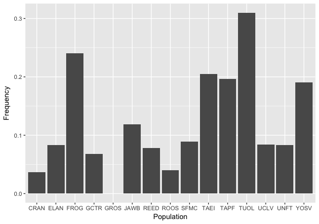

# For the purposes of the SEDES workshop we are going to cover some R Basics.

# 1.  R ... What is? And, why should you care.

https://www.r-project.org "R is a free software environment for statistical computing and graphics."

R is an open-source, and therefore is free, with a huge user base that uses it for a wide range of things, such as geographic information systems or gene expression. It provides a way to conduct custom operations and access the most current methods others are doing. 

# 2.  A basic operation, assignment

R is "object-oriented." That means for us everything in R has a class with fields we can access. I'll draw an example of an object of class "car."  
The car has a field "trunk", and I can retrieve something from the trunk of the car. It may also have something in the "passenger seat." This is the basics of what I think is important in R data structures.

  * Let's create a basic object, a vector. By assigning the numbers 1 to 4 to it. A vector contains data of all the same type.
  
numbers <- c(1,2,3,4)

You'll notice that numbers was added to our environment in RStudio. See what is in numbers:

numbers

  * We could of course make the same thing with characters

letters <- c("a","b","c","d")

  * And an object may be empty

alphabet <- c()

  * But we can add things to alphabet easily, note the $ sign is accessing a field (like the trunk of a car) 

alphabet\$Numbers<-numbers  
alphabet\$Letters<-letters

  * What does alphabet have in it now?

\> alphabet  
\$Numbers
[1] 1 2 3 4

\$Letters
[1] "a" "b" "c" "d"

  * What type of data structure is alphabet?

typeof(alphabet)

---
Time for a little task. You can also use a command to combine two vectors. These could be cbind, rbind or data.frame. Try to create an object using all three and see what they look like.

Where to start? help("rbind") If you are stuck, always look at the documentation.  
Which is most like alphabet?

# 3.  A basic operation, reading in data
Often, I have data in a text file such as .csv, that I'd like to do some analysis on. There is a handy R function for that.
---
Use read.csv to assign the contents of the file dfA.csv located in the data subdirectory to the object "data"
  
Don't forget, you can always look at help(read.csv)
  
# 4.  Operate on the new object "data"
  * The file contains allele frequency information from 15 populations. This is the anadromy associated (MAR type A) allele, and we have sample size information.

You can preview part of the data like so:  
\> head(data)  
  Population  N   Allele  Frequency  
1       YOSV 85 R04944.4 0.19047619  
2       SFMC 49 R04944.4 0.08888889  
3       CRAN 27 R04944.4 0.03703704  
4       ELAN 12 R04944.4 0.08333333  
5       FROG 25 R04944.4 0.24000000  
6       GCTR 22 R04944.4 0.06818182  

And summarize it:  
summary(data)  
\> summary(data)
   Population       N               Allele     Frequency        
 CRAN   :1    Min.   : 12.00   R04944.4:15   Min.   :0.00000    
 ELAN   :1    1st Qu.: 25.50                 1st Qu.:0.07331    
 FROG   :1    Median : 34.00                 Median :0.08397    
 GCTR   :1    Mean   : 54.67                 Mean   :0.12155    
 GROS   :1    3rd Qu.: 72.00                 3rd Qu.:0.19345    
 JAWB   :1    Max.   :150.00                 Max.   :0.31000    
 (Other):9                                                      

N is the number of individuals for each population. How many individuals total were sampled?

  * R is also very good at getting a "subset" of the data.  
  
Identify the populations in which the Frequency of R04944.4 is greater than the mean... With R, not by looking at the data!!!

# 5.  We can gain access to new functions outside base R with packages.

  * Install dplyr and ggplot2 and load these packages with "install.packages"
  * Load the packages with "library"
  * We'll convert data to a tibble and plot with ggplot

tibble<-tbl\_df(data)

Note: A tibble is a type of data frame, an object that contains vectors of the same length. 

  * With dplyr, we can manipulate our tibble. For example, we may want with a biallelic SNP to know the frequency of the alternative alele. We can use "mutate" to do this easily taking advantage of dplyr. There are a lot of possible things you can do we won't talk about now.

tibble \%\>\% mutate(AltFrequency = (1-Frequency))

  * A simple ggplot bar plot, ggplot is designed to work with data frames

ggplot(tibble)+geom\_bar(aes(Population, Frequency), stat="identity")  

  

(Eehhwww, looks bad)  

  * This looks better  
  
ggplot(tibble, aes(Population, Frequency, fill=Allele)) +  
    geom_bar(position=position_dodge(width=0.5), width = 0.7, stat="identity", color="black") +  
    theme(axis.text.x = element_text(angle = 90))  

  

### We can go on and on making things look nicer with ggplot. It has a lot of functions and you'll probably connect some figures to ggplot from the lecture material.

### I like the automatic nature of ggplot, I'll show you what I mean.

  *  Let's see features of ggplot by making up some data, say the alternative allele from tibble  

tibble2 <- tibble \%\>\% group\_by(Population, Allele="R04944.1", Frequency=(1-Frequency)) \%\>\% full\_join(tibble)

  * Let's talk about this command for a second ...  
  
---

Use  filter from dplyr to identify populations in that are larger than 50 in tibble2.

---

ggplot(tibble2, aes(Population, Frequency, fill=Allele)) +  
    geom_bar(position=position_dodge(width=0.5), width = 0.7, stat="identity", color="black") +  
    theme(axis.text.x = element_text(angle = 90))  

  

  * These two alleles aren't the most interesting, but the automatic nature of ggplot color codes and labels the alternative alleles now!  
  
  *  Perhaps more usefully, we can split the plots using facet_grid  
  
  ggplot(tibble2, aes(Population, Frequency, fill=Allele)) +  
    geom_bar(position=position_dodge(width=0.5), width = 0.7, stat="identity", color="black") +  
    theme(axis.text.x = element_text(angle = 90)) +  
    facet_grid(Allele ~ .)  

  

---

  * Another helpful thing to do is make histograms. With tibble2, create histograms for both alleles with ggplot.

  

Admittedly, this example is a bit silly, but I hope you see my point.

### Wow! Look at all the great stuff somehow has already made for you. Now that you know about them, take a look at the official pages sometime.  

http://dplyr.tidyverse.org  
http://ggplot2.tidyverse.org  

