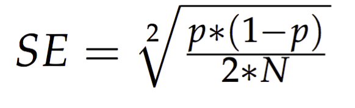
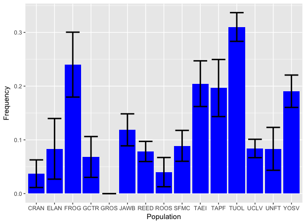
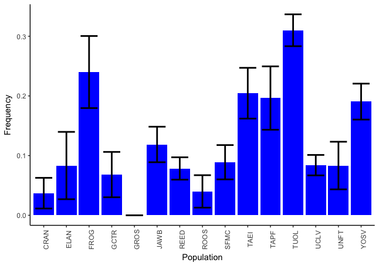
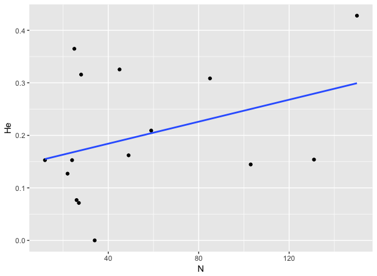

# Let's cover some more R basics!
## Keeping in mind R is a statisical language, let's apply some of that to our data. We'll calculate the standard error and plot it for our allele frequencies from the dfA.csv file.

Requires: dplyr and ggplot2 if you don't have them loaded. Check your "packages" tab in RStudio.

  * Get our data

data<-tbl_df(read.csv("./data/dfA.csv"))

  * Standard error, from Hartl and Clark (1997), _Principles of population genetics_, what a classic!!

  

## Let's look at what we have in data first and relate that to our formula. It is fifteen rows of this:

\# A tibble: 15 x 4  
   Population     N   Allele  Frequency  
       <fctr> <int>   <fctr>      <dbl>  
 1       YOSV    85 R04944.4 0.19047619  
 2       SFMC    49 R04944.4 0.08888889  
 3       CRAN    27 R04944.4 0.03703704 
 
---
 
   * With the mutate function in dplyr, can you add another column to the data tibble with SE? If you can, name it data2 and have it look like this:
   

\> data2  
\# A tibble: 15 x 5  
   Population     N   Allele  Frequency         SE  
       <fctr> <int>   <fctr>      <dbl>      <dbl>  
 1       YOSV    85 R04944.4 0.19047619 0.03011693  
 2       SFMC    49 R04944.4 0.08888889 0.02874725  
 3       CRAN    27 R04944.4 0.03703704 0.02569958  

  * For things like this, I usually start with what will happen in one operation before expanding to others, like so:  

  sqrt((0.19047619\*(1-0.19047619)/(2*85)))  
  
Just do it fifteen times really fast!

### Now, to plot.  Thankfully, there is a built error bar plotting feature of ggplot.

1. Generate a bar plot

ggplot(data2, aes(Population,Frequency)) +  
    geom_bar(stat="identity", fill="blue")

2. Add error bars, with geom_errorbar, it should look like this:

  

3. Make it look a bit nicer, perhaps with theme and axis.text? Maybe theme_classic() too?

  

### Another basic statistic, expected heterozygosity. 

--- 
Can you make a data3 tibble by calculating Expected heterozygosity using mutate again?

\# A tibble: 15 x 6
   Population     N   Allele  Frequency         SE         He  
       <fctr> <int>   <fctr>      <dbl>      <dbl>      <dbl>  
 1       YOSV    85 R04944.4 0.19047619 0.03011693 0.30839002  
 2       SFMC    49 R04944.4 0.08888889 0.02874725 0.16197531  
 3       CRAN    27 R04944.4 0.03703704 0.02569958 0.07133059  
 4       ELAN    12 R04944.4 0.08333333 0.05641693 0.15277778  
 5       FROG    25 R04944.4 0.24000000 0.06039868 0.36480000  
 6       GCTR    22 R04944.4 0.06818182 0.03799912 0.12706612  
 7       GROS    34 R04944.4 0.00000000 0.00000000 0.00000000  
 8       JAWB    59 R04944.4 0.11864407 0.02976855 0.20913531  
 9       TUOL   150 R04944.4 0.31000000 0.02670206 0.42780000  
10       REED   103 R04944.4 0.07843137 0.01873161 0.14455979  
11       ROOS    26 R04944.4 0.04000000 0.02717465 0.07680000  
12       TAEI    45 R04944.4 0.20454545 0.04251883 0.32541322  
13       TAPF    28 R04944.4 0.19642857 0.05309096 0.31568877  
14       UCLV   131 R04944.4 0.08396947 0.01713425 0.15383719  
15       UNFT    24 R04944.4 0.08333333 0.03989280 0.15277778  

---

  * A question I may have is what is the relationship between population size and He.

Plot N on the X and He on the Y with geom_point.

  

Now, include a trendline  

  

Unfortunately, I have not found that linear model information is easy to extract with ggplot.  Fortunately, there is a "lm" in R we can use. Fit a linear model of expected heterozygosity on sample size and detrmine if the observed trend is meaningful.

My findings:

Residuals:
     Min       1Q   Median       3Q      Max 
-0.17787 -0.09595 -0.01463  0.10286  0.19635 

Coefficients:
             Estimate Std. Error t value Pr(\>|t|)  
(Intercept) 0.1422948  0.0502953   2.829   0.0142 \*
data3\$N     0.0010463  0.0007332   1.427   0.1772  
---
Signif. codes:  0 ‘\*\*\*’ 0.001 ‘\*\*’ 0.01 ‘\*’ 0.05 ‘.’ 0.1 ‘ ’ 1

Residual standard error: 0.1177 on 13 degrees of freedom
Multiple R-squared:  0.1354,	Adjusted R-squared:  0.0689 
F-statistic: 2.036 on 1 and 13 DF,  p-value: 0.1772  

---
