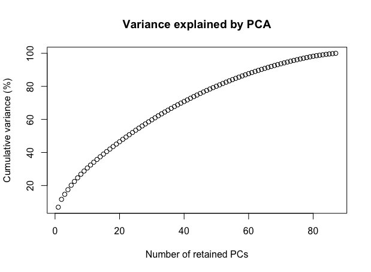
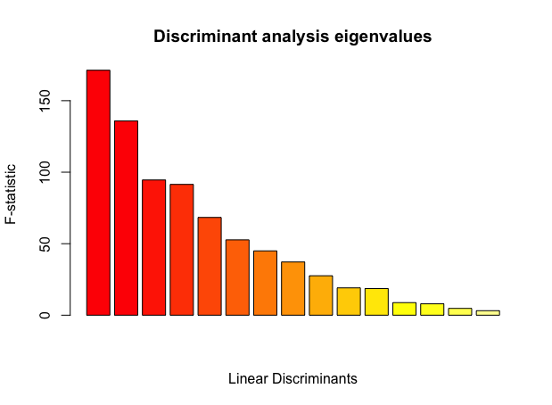
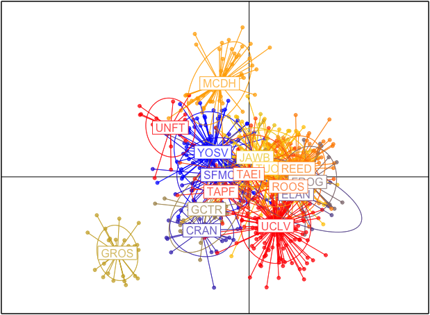
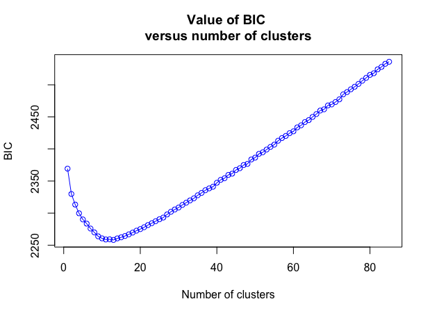
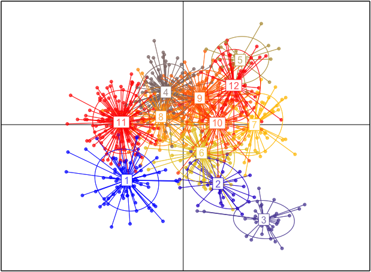
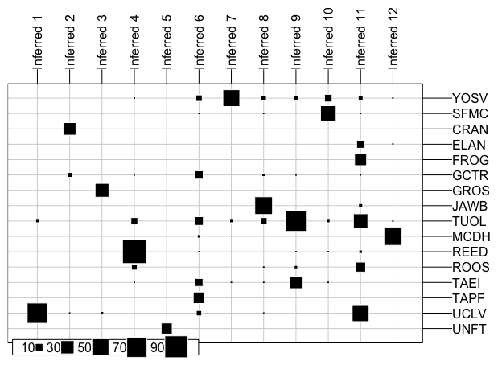
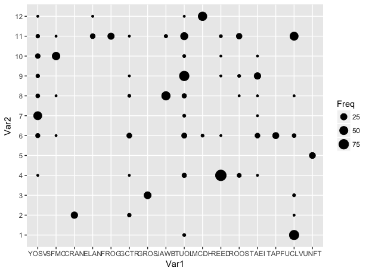
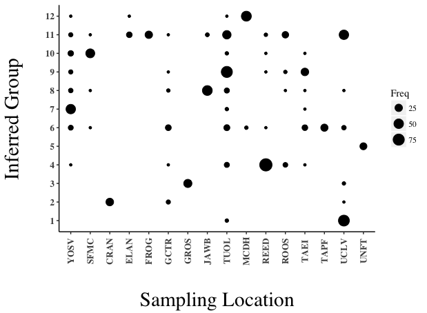

# Here, let's examine some existing packages and functions that are available, part 2. DAPC

### What the heck is DAPC?

Source paper: https://bmcgenet.biomedcentral.com/articles/10.1186/1471-2156-11-94

The corresponding R package is extensively documented by Thibaut Jombart and many resources are already available. https://github.com/thibautjombart/adegenet/wiki/Tutorials  

The main take home from me from __D__ iscriminant __A__ nalysis of __P__ rincipal __C__ omponents (DAPC) is that you can infer the number of groups (aka genetic clusters) from your data without prior knowledge.  This is a task we do subjectively all the time. What makes a sampling location? How many clades are meaningful? Etc.

Survey: Do you use STRUCTURE or DAPC now? My thoughts are that you should do both, but we don't have time to get into STRUCTURE.

### What is it doing?

DAPC is converting our data data in principal components, after which it conducts a discriminant analysis. In my mind its major strengths are:
  *  Allows for linked loci
  *  Does not assume an underlying population genetics model (e.g. panmixia)
  *  Computationally less demanding than, say, STRUCTURE

DAPC is using general mathematical procedures on our genetic data.  Principal Component (PC) analysis is often used to find axes of variation. E.g. from the lecture material.

  

Plotting principal components shows axes of maximal variation, but does show axes that maximally distinguish groups?

### Let's generate DAPC and PC plots from our data and see what we find!

First off, we can load the data we stored earlier.

load("filtered.rda")

\> filtered
/// GENIND OBJECT /////////

 // 848 individuals; 87 loci; 174 alleles; size: 676.6 Kb

#### 1. DAPC

First, we can see how to differentiate predefined populations with dapc. Make sure the packaged "adegenet" is loaded and then:

d1<-dapc(filtered)

We have to make some choices here...

1. Retained PCs. Too many PCS = overfitting. 60-70 seem ok to me. Trying several to see behavior is advisable.

  

2. Eigenvalues. The adegenet material has this advice "Whenever more (say, tens of) clusters are analysed, it is likely that the first few dimensions will carry more information than the others, and only those can then be retained and interpreted."

Again, trying several iterations to see what affects there are is always advisable.

  

d1 is loaded with things! View by typing d1

\>d1

If you want, you can pick apart the dapc object d1 for various reasons and for plotting on your own.

Let's look at the basic scatter provided.

scatter(d1)

There is some customization possible with scatter, such as adding scree.da = FALSE.

  * Let's talk about what is represented for a minute

  

##### You probably noticed that we didn't objectively assign anything to any group. Let's do that now.

#### 2. DAPC with find clusters.

Let's kick this off like so:

groups<-find.clusters(filtered)

That will produce a BIC plot.

  

Interpreting these is a bit artisitic in my opinion. 12 seems apropriate.

 * groups is an oject that contains the obective assignment of our individuals
 * You should view it
 
\> groups

---

Now, let's try to use our assigned grouping to conduct a DAPC by using these in the dapc command. Assign the output to objDAPC.  I'll be helpful and provide the Arguments for the dapc command

|Arguments |  |  
|----|-------------------------------------------------------------------|  
| x	 | a data.frame, matrix, or genind object. For the data.frame and matrix arguments, only quantitative variables should be provided.|  
| grp,pop	| a factor indicating the group membership of individuals; for scatter, an optional grouping of individuals.|  

This is what I ended up with. What do you think about this and the previous DAPC? 

Default population assignment |  Objective population assignment
:-------------------------:|:-------------------------:
  |  

---

##### How about relating the assigned groups back to our samples?

By returning to our DAPC using the sampling units, we can see how well individuals assigned to populations with "assignplot." The whole output is a bit difficult to present due to size, but we can take a look at a small set.

assignplot(objDAPC, subset=1:25)  

 

A way I prefer is this

table(pop(filtered), objDAPC\$grp)  

||1|2|3|4|5|6|7|8|9|10|11|12|
|---|---|---|---|---|---|---|---|---|---|---|---|---|
__YOSV__ | 0 |  0 | 0 | 1 | 0 | 7 | 49 | 5 | 4 | 10 | 4 | 1 | 
__SFMC__ | 0 |  0 | 0 | 0 | 0 | 1 | 0 | 1 | 0 | 42 |  1 | 0  |
__CRAN__ | 0 | 27 | 0 | 0 | 0 | 0 | 0 | 0 | 0 | 0 | 0 | 0  |

etc..

##### What is going on here?
  * An alternative way of viewing it.
  
table.value(table(pop(filtered), objDAPC\$grp), col.lab=paste("Inferred", 1:12), row.lab=popNames(filtered))

 

---

Can you create a ggplot version of the previous plot? 

Basic |  Nicer
:-------------------------:|:-------------------------:
  |  

To get from Basic to Nicer I used the following:

  theme(axis.title.y = element_text(size = rel(2)))+  
  theme(axis.title.x = element_text(size = rel(2)))+  
  theme(axis.text.x = element_text(angle = 90))+  
  labs(x="\\nSampling Location", y="Inferred Group\\n")+  
  theme(panel.grid.major = element_blank(), panel.grid.minor = element_blank(),   
        panel.background = element_blank(), axis.line = element_line(colour = "black"))+  
  theme(text=element_text(family='Times'))+  
  theme(axis.text.x= element_text(face="bold", size=10, vjust = 0.5))+  
  theme(axis.text.y= element_text(face="bold", size=10))  

---

For a challenge, you can plot individuals with coordinates from DAPC and from PCA and see the differences. Generating PCA is covered in the adegenet tutorial material.   

https://github.com/thibautjombart/adegenet/raw/master/tutorials/tutorial-basics.pdf

